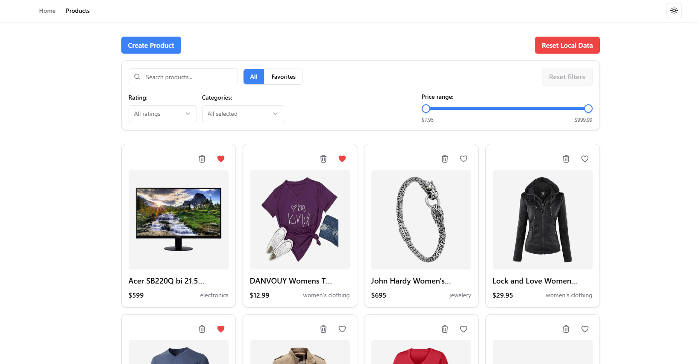
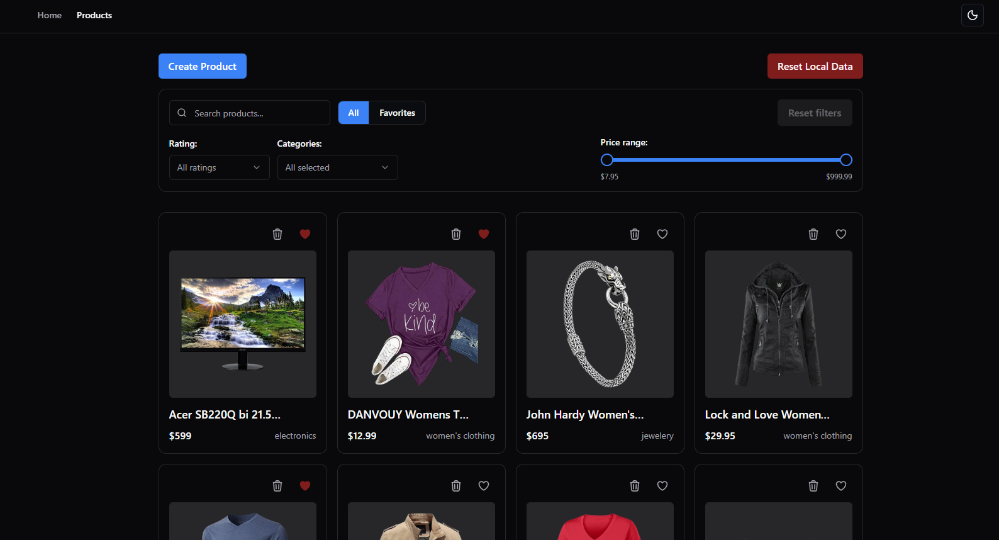
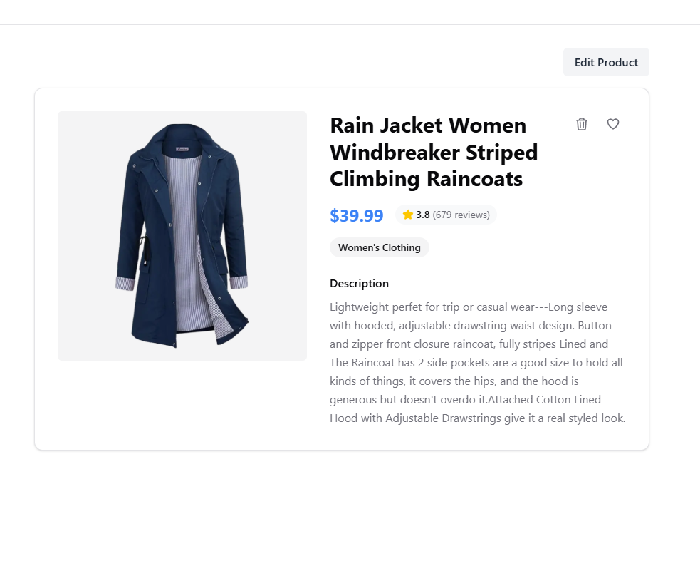
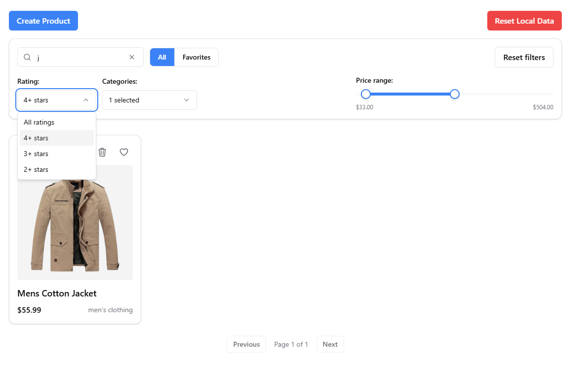
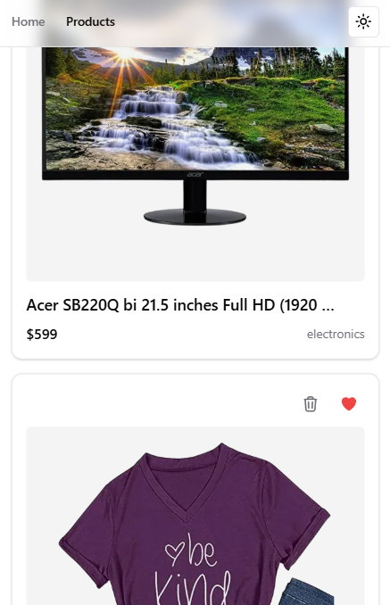
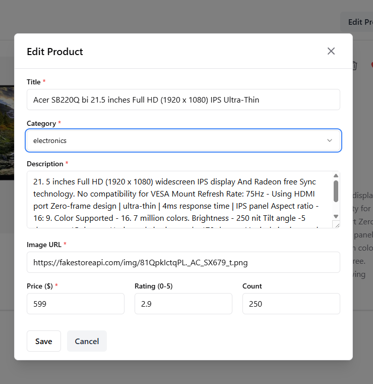

# Product Showcase

**Live Demo:** [https://prod-show-case.vercel.app/](https://prod-show-case.vercel.app/)

Modern product showcase built with Next.js 16, React 19, and Feature-Sliced Design architecture. Demonstrates scalable frontend patterns, advanced state management, and production-ready UI/UX.

---

## 📸 Screenshots

<table>
  <tr>
    <td width="50%">
      
      <p align="center"><strong>Products List (Light Mode)</strong></p>
    </td>
    <td width="50%">
      
      <p align="center"><strong>Products List (Dark Mode)</strong></p>
    </td>
  </tr>
  <tr>
    <td width="50%">
      
      <p align="center"><strong>Product Detail Page</strong></p>
    </td>
    <td width="50%">
      
      <p align="center"><strong>Filters & Search in Action</strong></p>
    </td>
  </tr>
  <tr>
    <td width="50%">
      
      <p align="center"><strong>Mobile Responsive</strong></p>
    </td>
    <td width="50%">
      
      <p align="center"><strong>Create/Edit Product Form</strong></p>
    </td>
  </tr>
</table>

---

## 🚀 Tech Stack

- **Next.js 16** (App Router) + **React 19** + **TypeScript**
- **Feature-Sliced Design (FSD)** architecture
- **Redux Toolkit + RTK Query** (state & API)
- **React Hook Form + Zod** (forms & validation)
- **Tailwind CSS v4** (semantic design tokens)
- **Vitest + Playwright** (174+ tests)

---

## 📋 Features

- **Product Management:** Browse API products, create/edit local products, soft/hard delete
- **Advanced Filtering:** Debounced search, multi-select categories, price range, rating, favorites
- **Persistence:** localStorage with SSR-safe hydration, auto-cleanup on delete
- **UI/UX:** Dark/light theme, toast notifications, responsive grid, loading skeletons, error boundaries
- **Developer Experience:** Smart Widgets pattern, factory selectors, strict FSD layer rules

---

## 🏛️ Architecture

```
src/
├── app/        # Routes, providers
├── widgets/    # Smart UI (data fetching)
├── features/   # Business logic
├── entities/   # Data models & API
└── shared/     # UI components & utils
```

**FSD Rules:** Top → Bottom imports only (app → widgets → features → entities → shared)

**Smart Widgets:** Widgets own data fetching, pages are thin routing layers

**Persistence:** Custom middleware for selective localStorage sync (`favorites`, `localProducts`)

See **[docs/ARCHITECTURE.md](docs/ARCHITECTURE.md)** for details.

---

## 🛠️ Quick Start

```bash
# Install
pnpm install

# Develop
pnpm dev
# → http://localhost:3000
```

---

## 🎯 Key Highlights

### Architecture

- FSD implementation with strict layer rules
- RTK Query with `baseApi.injectEndpoints()` pattern
- SSR-safe hydration via `createPreloadedState()`

### Testing

- 174+ unit/component tests (Vitest)
- E2E tests (Playwright)
- Pre-commit hooks (Prettier + ESLint + tests)

### Production Patterns

- Error boundaries, loading states, empty states
- Confirmation modals for destructive actions
- Theme persistence, toast notifications

---

## 📚 Documentation

- **[docs/ARCHITECTURE.md](docs/ARCHITECTURE.md)** - Architecture, data flow, decisions
- **[docs/TODO.md](docs/TODO.md)** - Portfolio improvements

---

**Last Updated:** 2025-11-30
